<!-- omit in toc -->
# Bargain Bin Electronics

<!-- omit in toc -->
## Description
This is an e-commerce marketplace app for buying and selling electronic items. The app is built with Node.js, Express.js to create a RESTful API, Handlebars.js as the templating engine, MySQL and the Sequelize ORM for the database. User must register and sign in to use the marketplace. Once logged-in, user can create, edit and delete listing, add an existing listing to either wishlist or cart. User can also search items using the search bar.
<br>
The checkout feature is still in progress and will be constantly updating.
<br>
You can check out the deployed application from the link below:
<br>
[https://bargain-bin-electronics.herokuapp.com/](https://bargain-bin-electronics.herokuapp.com/)

<!-- omit in toc -->
## Table of Contents
- [Technologies](#technologies)
- [Installation](#installation)
- [Usage](#usage)
- [License](#license)

## Technologies
Project is created with:
- Node.js
- Express.js
- Handlebars.js
- MySQL
- Sequelize
- Bootstrap

## Installation
- Install [Node.js v16](https://nodejs.org/en/blog/release/v16.16.0/) and [npm](https://www.npmjs.com/)
- Install [MySQL Server](https://dev.mysql.com/doc/mysql-getting-started/en/#mysql-getting-started-installing)
- Install npm packages:
  ```
  npm install
  ```

## Usage
1. Change the name of `.env.EXAMPLE` file to `.env`
2. Enter your MySQL username and MySQL password in the `.env` file:
    ```yaml
    DB_NAME='bargainbin_db'
    DB_USER='<your_mysql_username>'
    DB_PASSWORD='<your_mysql_password>'
    ```
3. Create and select your database with MySQL shell commands:
    ```
    mysql -u root -p
    ```
    ```shell
    mysql> source db/schema.sql;
    mysql> quit;
    ```
4. Seed the test data to your database:
    ```
    npm run seed
    ```
5. Execute the app and run the server:
    ```
    npm start
    ```
- Index page
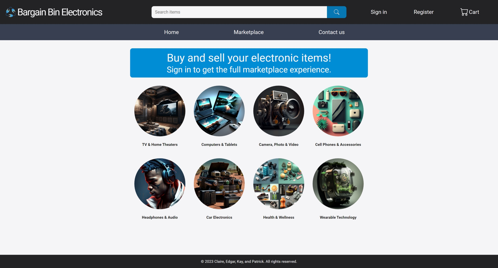
- Sign in page
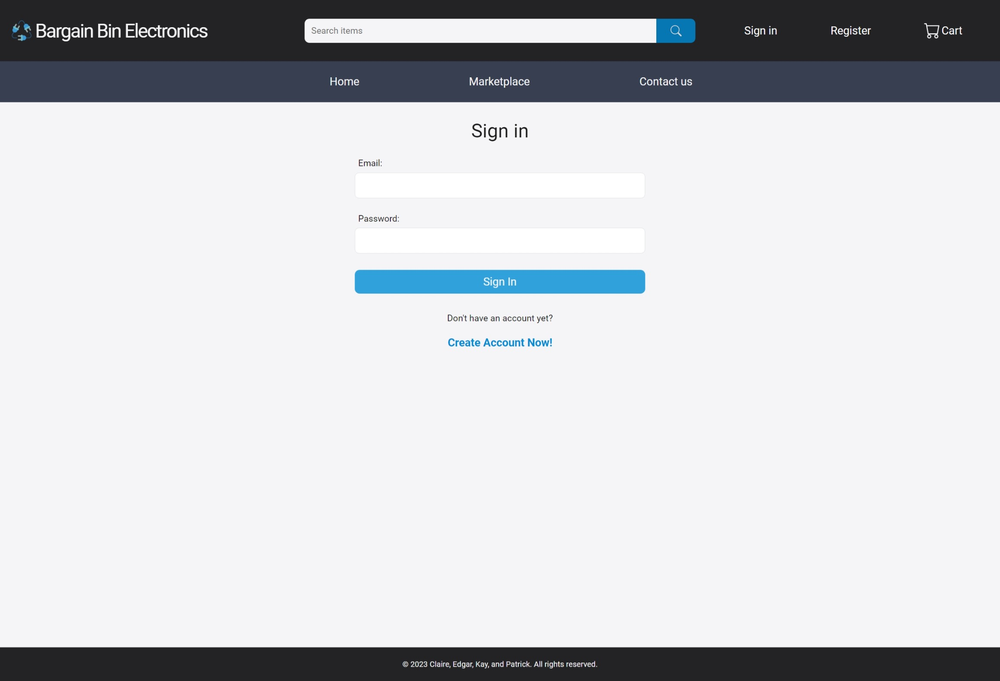
- Register page
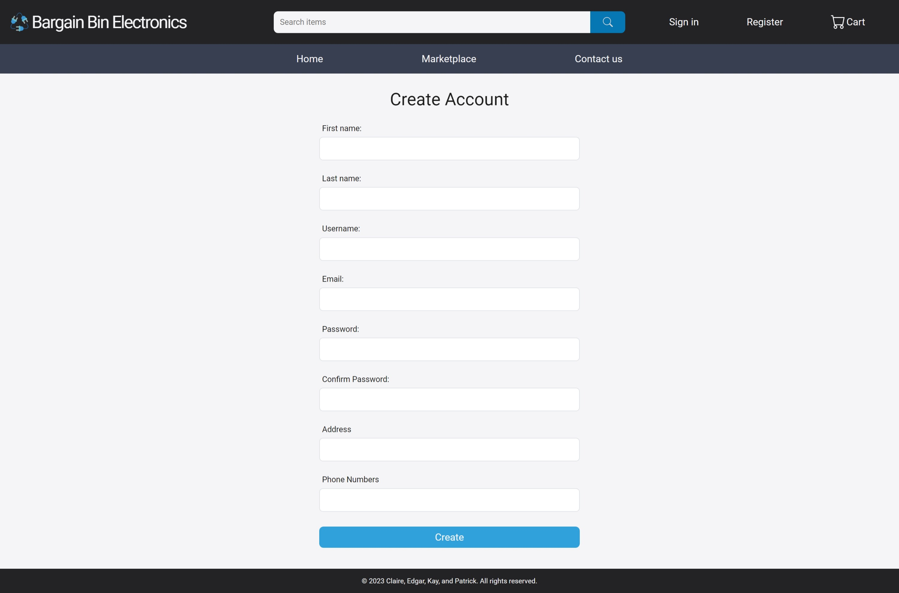
- Marketplace page
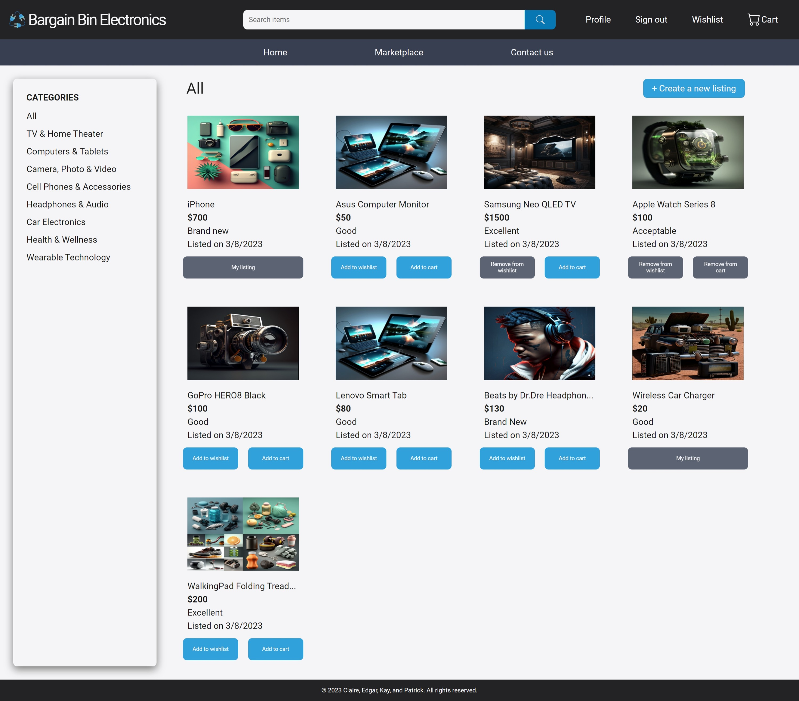
- Product details page
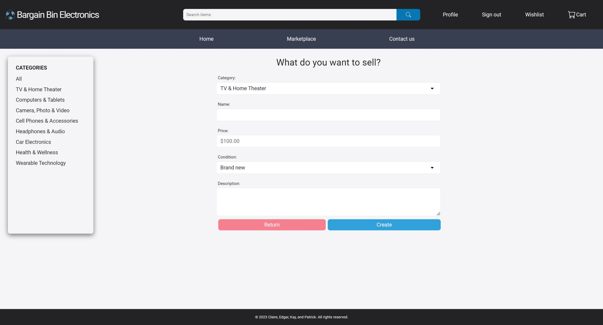
- Create listing page
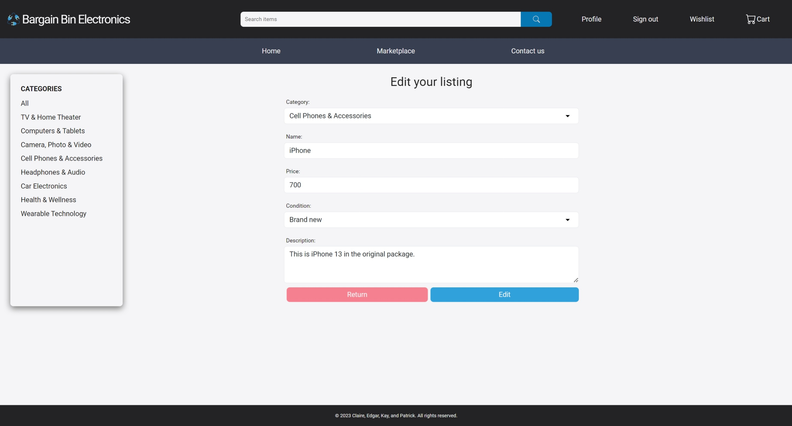
- Edit listing page
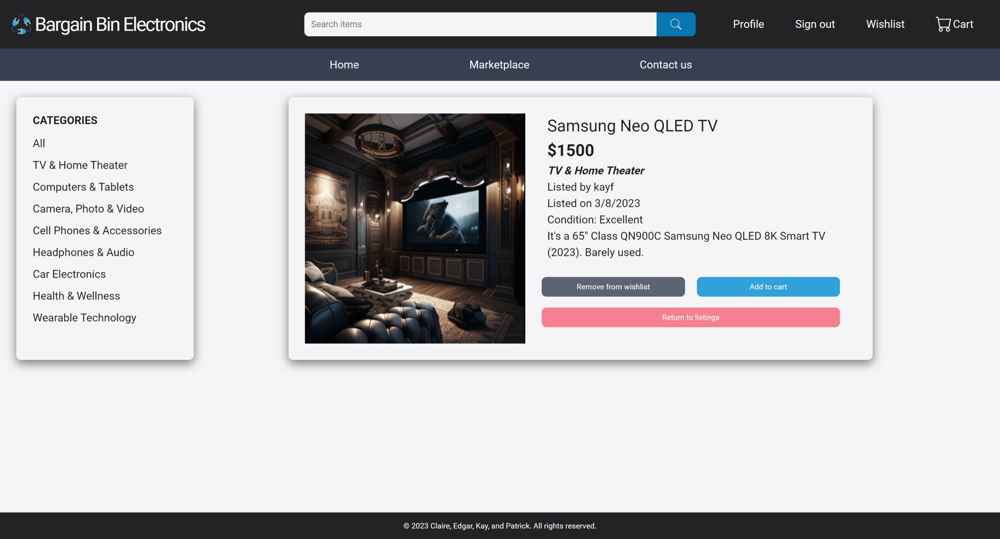
- Wishlist page
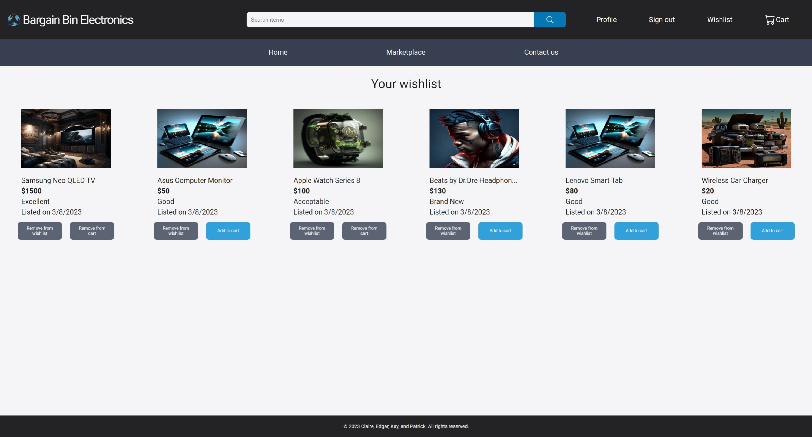
- Cart page
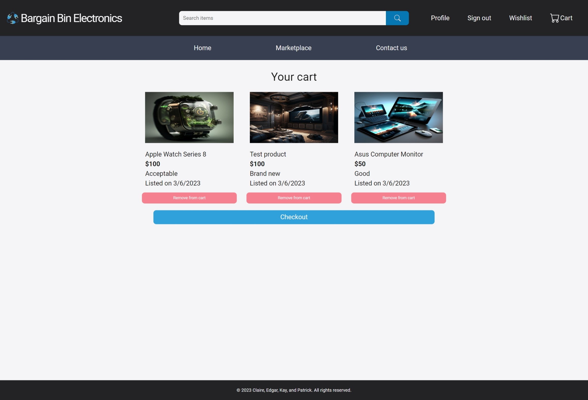
- Checkout page
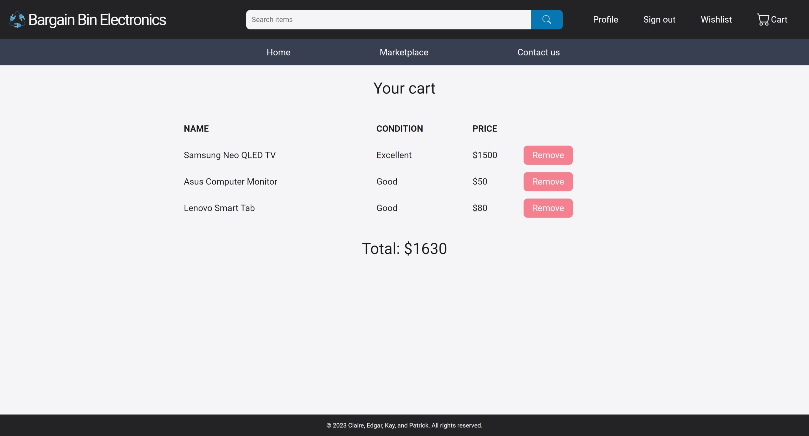
- Contact_us page
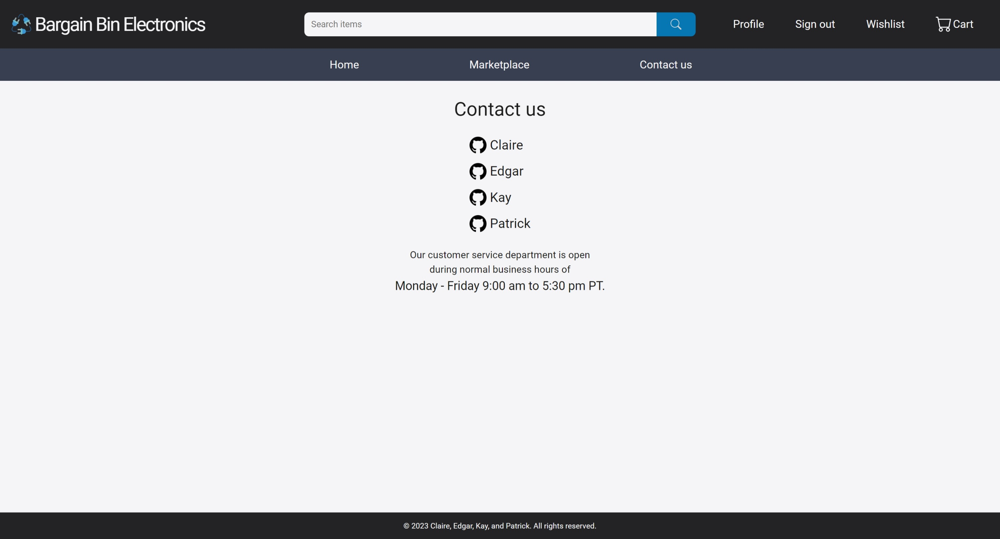

## License
Copyright © 2023 [Claire Hyung Won Cho ](https://github.com/clairehwcho),
[Edgar Vargas](https://github.com/e-varg24),
[Kay Ford](https://github.com/poptartkay), and
[Patrick Delaney](https://github.com/Pat-Delaney)